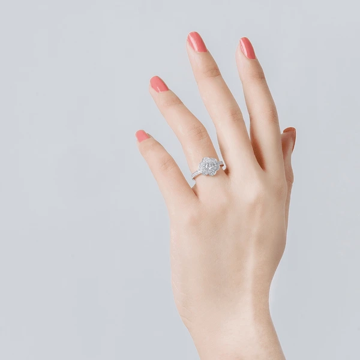

<h2>💍 Virtual Ring Try-On</h2>

An AI-powered Virtual Ring Try-On system that lets users visualize how a ring looks on their hand.
The pipeline combines computer vision and generative AI techniques:

<h4>Mediapipe Hand Detection – detect and localize hand.</h4>

<h4>Segment Anything (SAM) – isolate the ring region.</h4>

<h4>Traditional Compositing – place the ring onto bare hand templates.</h4>

<h4>Stable Diffusion 1.5 + ControlNet (Inpainting) – refine compositing with realistic shadows, reflections, and lighting.</h4>

<h4>Real-ESRGAN – upscale the final output for sharp, high-quality results.</h4>

<h3>✨ Features</h3>

<ul>
  <li>Upload a hand wearing a ring → the system extracts the ring and transfers it to a bare hand.</li>

  <li>Users can upload their own bare hand for try-on.</li>

  <li>Outputs high-resolution, photo-realistic results thanks to ESRGAN enhancement.</li>

  <li>Gradio-powered interactive web UI.</li>
</ul>

<h3>🖼️ Demo</h3>

<p align="center">    </p>

<p align="center">    </p>

<h3>🚀 Installation</h3>

<h4>Clone this repo:</h4>

```
git clone https://github.com/trongkhanh083/virtual-try-on-ring.git
cd virtual-try-on-ring
```

<h4>Create a conda or venv environment:</h4>

```
conda create -n ringvton python=3.10 -y
conda activate ringvton
```

<h4>Install dependencies:</h4>

```
pip install -r requirements.txt
```

<h4>Download SAM + Real-ESRGAN checkpoint</h4>

```
wget https://dl.fbaipublicfiles.com/segment_anything/sam_vit_b_01ec64.pth
```
```
git clone https://github.com/xinntao/Real-ESRGAN.git
cd Real-ESRGAN
python setup.py develop
wget https://github.com/xinntao/Real-ESRGAN/releases/download/v0.1.0/RealESRGAN_x4plus.pth -P weights
```

<h3>⚙️ Usage</h3>
<h4>Run the Gradio app</h4>

```
python app.py
```

<h3>🖥️ Hardware Requirements</h3>

GPU strongly recommended

At least 8GB VRAM for Stable Diffusion + Controlnet.
